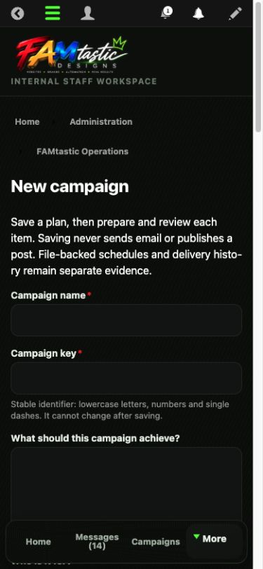
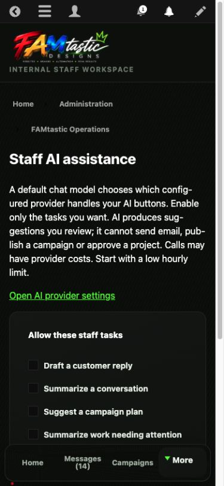

# Fritz’s command center: everyday tasks

Review date: October 6, 2026. Release identity and live checks are recorded in [the release evidence](OWNER_HANDOFF_2026-10-06.md). This guide matches deployed release `7810aa9e786cb0dab01dcad0e67a6a258daea72e`. Authenticated task verification is recorded separately; Fritz’s independent use remains pending. The September 30 guide remains a historical receipt.

## Start on your phone

Sign in at [FAMtastic Designs](https://famtasticdesigns.com/web/user/login), then open **My command center** (`/web/admin/famtastic`). Use your existing private credentials. The **What needs me** section shows stored work that needs attention. **Messages** takes you to customer conversations; **Campaigns** takes you to campaign work. **More** opens the remaining navigation. Missing controls can mean your account lacks the required staff permission.

Capability: `famtastic.mobile-command-home`. Opening a queue changes no customer record. Follow the relevant action to handle the work; reading an AI summary does not complete it.

This production installation uses the `/web` prefix. Direct links: [Home](https://famtasticdesigns.com/web/admin/famtastic), [Messages](https://famtasticdesigns.com/web/admin/famtastic/messages), [Campaigns](https://famtasticdesigns.com/web/admin/famtastic/campaigns), [Marketing workspace](https://famtasticdesigns.com/web/admin/famtastic/marketing), and [AI assistance](https://famtasticdesigns.com/web/admin/famtastic/ai-assistance). These are links to the intended deployed screens; current-release verification is recorded separately. Other tools remain in **More** and the Drupal administration menu; this guide covers the four changed workflows only.

## Plan a campaign of any length

Capability: `famtastic.campaign-draft-planning`.

1. Open **New campaign** at `/web/admin/famtastic/campaign/add`.
2. Enter a **Campaign name**, a stable **Campaign key**, goal, audience, offer and next action. Use lowercase letters, numbers and single dashes in the key, for example `october-owner-practice`.
3. Choose **Planning channels**, **Start date** and **End date**. Write your **Content plan**. Use **Add content row** for an individual dated idea and channel.
4. Choose **Save draft plan**. Reopen the campaign and use **Edit plan** to check that your dates and content survived reload.
5. Duplicate an existing plan when you want a separate campaign. Use **Archive campaign** to remove it from current planning and **Restore as draft** to bring it back.

The saved result is an internal draft plan. Choosing channels does not connect accounts or publish posts. Archiving does not cancel anything already scheduled with a publishing provider. Keep the existing public publishing workflow separate and check **Channel health** before scheduling. The previous Postiz connection was offline on September 30; this guide does not establish recovery today.

Live production, October 6, release `7810aa9`: the blank **New campaign** form on a 390 × 844 viewport. The image shows the opening fields and bottom navigation. Scroll for later fields and **Save draft plan**. This picture proves the form renders; it does not prove a saved campaign.

## Save and preview a customer reply

Capability: `famtastic.communication-drafts`.

1. Open **Messages** (`/web/admin/famtastic/messages`) and the intended conversation. Confirm the customer and read the history.
2. Choose **Message purpose**: **Personal reply**, **Ask for missing information**, **Follow up on a conversation**, or **Acknowledge a message**. Add your question or update and choose **Use purpose template**.
3. Edit the wording and choose **Save draft**. Reload and confirm it is still there.
4. Choose **Preview and review**. Check the branded message, plain text and exact recipient.
5. When you intend to send, check the exact-recipient authorization and choose **Send reviewed reply**. If you change the draft after review, preview again.

Saving and previewing do not send email. A queued message is waiting for the delivery worker; it is not proof of inbox delivery. A sent message cannot be recalled by editing the draft. These templates work inside existing conversations; this release does not add bulk marketing email or an arbitrary-recipient composer.

**Staff record group** offers **Customer work**, **Explicit test** and **Archived**. Choose the correct group and **Save record group**; changing it back restores the classification without deleting the conversation. In the Email Center (`/web/admin/famtastic/marketing/email`), customer communication, operational alerts and failed deliveries are separate views.

## Put the AI model to work

Capability: `famtastic.staff-ai-tasks`.

Open **Staff AI assistance** (`/web/admin/famtastic/ai-assistance`). A default chat model chooses the engine to ask; it does not automatically run any task. **Open AI provider settings** leads to provider configuration. The current task adapter supports configured OpenAI chat models. Enable the desired tasks under **Allow these staff tasks** and set **Maximum AI requests per staff member per hour**.

At this release check, all four task checkboxes were off and the hourly limit was 5; no setting was changed. Once configured, enabled and proven with a live test, AI can draft replies, summarize conversations, suggest campaign ideas from a saved brief, and summarize the Home workload. You still review and save the result. AI does not send, publish, approve projects or collect payments. Provider calls may cost money. A disabled button with setup guidance means the task is not ready; manual drafting remains available. Configuration alone is not evidence that a real model call works.

Live production, October 6, release `7810aa9`: **Staff AI assistance** on a 390 × 844 viewport. All four task checkboxes are off. Scroll to reach the hourly limit and **Save configuration**, which are below this image. The screenshot does not establish a connected model or a completed AI call.

## First practice session

On your phone, create a clearly labeled practice campaign, save it, reopen it, change one dated idea, save again, archive and restore it. Then use an explicitly designated training conversation to save a reply and preview it without sending. Finally, use **More** to find **Staff AI assistance** and read its readiness message. The expected results and acceptance record are in [the handoff](OWNER_HANDOFF_2026-10-06.md).

These are instructions for your first independent walkthrough, not a claim that you have already completed it. The current hosted Home and blank campaign form were inspected at a 390 × 844 browser viewport. The campaign save was not exercised: browser navigation interrupted form entry before submission. No training conversation was designated, so current hosted message save/preview remains unverified. No historical screenshot is presented as current proof.
