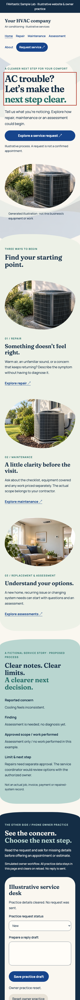
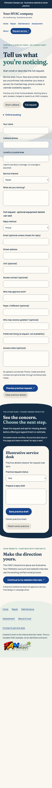

# Owner use / release-matched limits

Use the generic preview in RELEASE.json on your phone. This Lab uses fictional practice details. The physical owner task has not been observed.

1. Open Repair, Maintenance and Assessment; return Home. Check the labelled illustrations and unconfirmed company facts.
2. Open Request service → Short callback. Enter fictional name/phone/area/issue and preview. Expect “Practice request prepared,” not received or booked. Clear reverses it.
3. Choose Full request; enter fictional manual address/work approver. Email is optional for phone reply, required when Email is chosen. Missing fields keep answers and focus the problem. Nothing reaches an HVAC contractor.
4. Read the summary in the phone owner desk. Prepare and save a practice reply. Expect “Nothing sent.” Reset/reload reverses practice.
5. The real FAMtastic interview link uses the existing account process. A public generic preview has no recipient token. An independently prepared native invitation binds its own exact verified-email account/context. No recipient invitation or campaign email is created by this release.

Capability IDs:hvac.six-pages,hvac.branched-practice,hvac.owner-practice,hvac.verified-continuation. Owner task IDs:hvac-phone-navigation, hvac-phone-request, hvac-phone-draft, hvac-account-interview. Device/observation:pending. Revision:RELEASE.json. Expected result/reversal as above. Developer emulated-phone evidence does not establish owner acceptance.

Booking calendar, real contractor requests/alerts, provider messages, prices/policies and actual service outcomes need separate verified implementation. Acquisition use requires a reviewed matching email and recipient eligibility. Component Studio contribution is ready to import; import/use has not been proven.

## Actual local phone screens

Capture viewport390×844; full-page pixel height differs. Manifest:evidence/screenshots.json. Release/runtime proof is separate in RELEASE.json.
